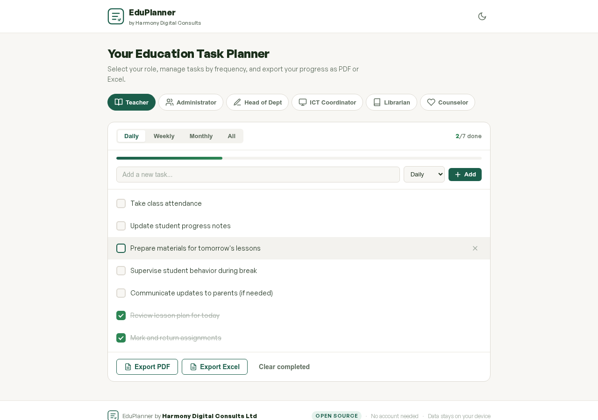
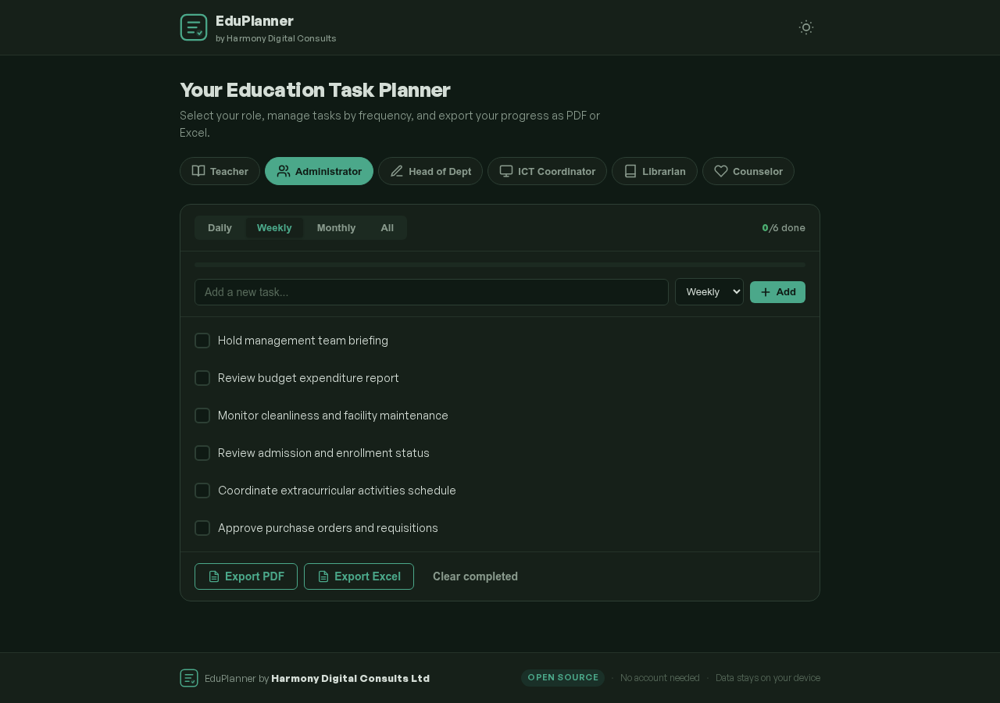
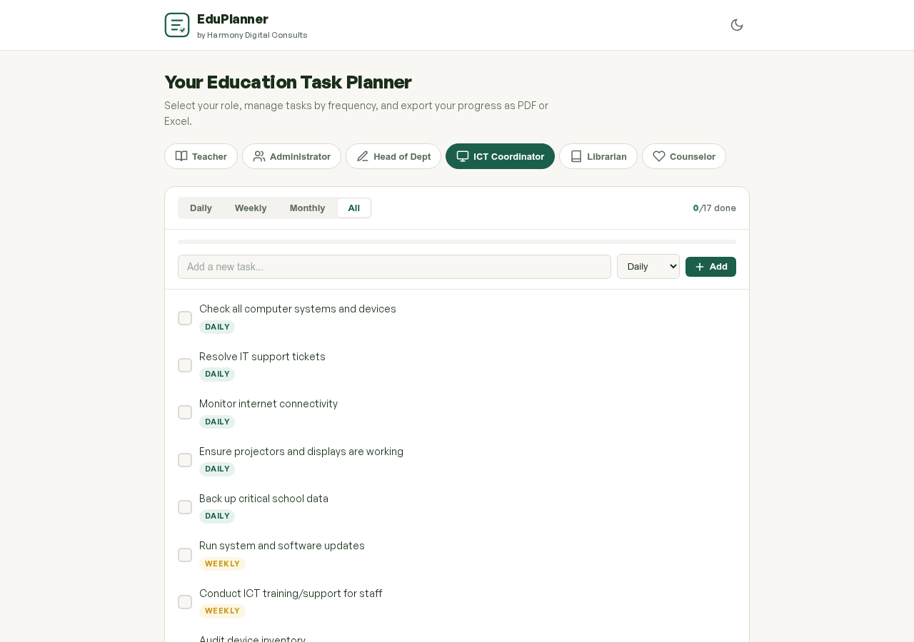
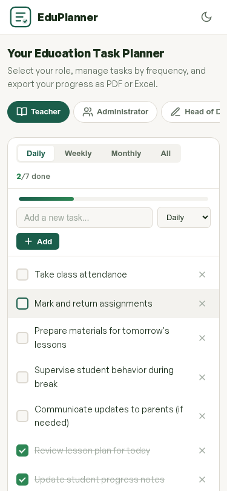
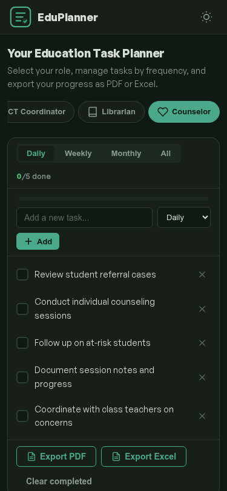

<div align="center">


# EduPlanner

**A free, role-based task planner for educators.**

Built by [Harmony Digital Consults Ltd](https://harmonyconsults.com) — Anambra State, Nigeria.

[](https://eduplanner.harmonydigitalconsults.com.ng)
[](https://chukwuemerie-ezieke.github.io/eduplanner/)
[](LICENSE)

</div>

---

## The Problem

Nigerian school staff juggle dozens of recurring tasks — lesson plans, attendance, reports, meetings, IT maintenance, student welfare — often tracked on paper or scattered across personal notes. Generic productivity tools require sign-ups, training, and reliable internet that many schools lack.

## The Solution

EduPlanner gives every school role a ready-to-use task module with pre-populated daily, weekly, and monthly tasks. No signup. No internet after first visit. Export to PDF or Excel for physical record-keeping.

---

## Screenshots

### Light Mode — Teacher Daily Tasks


### Dark Mode — Administrator Weekly Tasks


### All Tasks View — ICT Coordinator


<details>
<summary><strong>📱 Mobile Views</strong></summary>

<div align="center">
&nbsp;&nbsp;&nbsp;

</div>

</details>

---

## Features

| Feature | Description |
|---------|-------------|
| **6 Dedicated Roles** | Teacher, Administrator, Head of Department, ICT Coordinator, Librarian, School Counselor |
| **Pre-populated Tasks** | Each role ships with common daily, weekly, and monthly tasks — ready to use instantly |
| **Custom Tasks** | Add your own tasks to any frequency category |
| **PDF Export** | Generate branded, printable task reports |
| **Excel Export** | Download task data as `.xlsx` spreadsheets |
| **Works Offline (PWA)** | Install on any phone or computer — full functionality without internet |
| **Dark Mode** | Auto-detects system preference with manual toggle |
| **No Signup Required** | Zero accounts, zero cost, zero data collection |
| **localStorage** | Data persists across sessions on the same device |
| **Open Source** | MIT License — customize and redistribute freely |

---

## Tech Stack

| Component | Technology |
|-----------|------------|
| Frontend | Vanilla HTML, CSS, JavaScript |
| Storage | Browser localStorage |
| Backend | None (zero hosting cost) |
| Excel Export | [SheetJS](https://sheetjs.com/) |
| Offline | Service Worker + Web App Manifest |
| Typography | [General Sans](https://www.fontshare.com/fonts/general-sans) via Fontshare |
| Design | Forest Green `#1B5E4B` + Warm Gold `#C4960A` |

---

## Getting Started

### Use Online (Recommended)

Visit **[eduplanner.harmonydigitalconsults.com.ng](https://eduplanner.harmonydigitalconsults.com.ng)** in any browser. That's it.

To install as an app, click the **Install** button in the header (or use your browser's "Add to Home Screen" option on mobile).

### Self-Host

EduPlanner is a static site — no build step, no dependencies, no server required.

```bash
# Clone the repository
git clone https://github.com/Chukwuemerie-ezieke/eduplanner.git
cd eduplanner

# Option 1: Python
python3 -m http.server 8000

# Option 2: Node.js
npx serve .

# Option 3: PHP
php -S localhost:8000

# Then open http://localhost:8000
```

Or simply open `index.html` directly in your browser.

### Deploy to GitHub Pages

1. Fork this repository
2. Go to **Settings → Pages**
3. Set source to `main` branch, root folder
4. Your app will be live at `https://yourusername.github.io/eduplanner`

### Deploy to Netlify / Vercel

Drag and drop the project folder — no configuration needed.

---

## Project Structure

```
eduplanner/
├── index.html          # Main HTML structure
├── style.css           # All styles (light + dark mode)
├── app.js              # App logic, task management, exports
├── sw.js               # Service worker for offline support
├── manifest.json       # PWA manifest
├── LICENSE             # MIT License
├── CNAME               # Custom domain config
├── icons/
│   ├── favicon.svg     # SVG favicon
│   ├── icon-192.png    # PWA icon 192x192
│   └── icon-512.png    # PWA icon 512x512
└── screenshots/
    ├── hero-light.png
    ├── dark-mode.png
    ├── all-tasks.png
    ├── mobile.png
    └── mobile-dark.png
```

---

## Roles & Pre-loaded Tasks

Each role comes with curated tasks across three frequencies:

### 👩‍🏫 Teacher
Daily: lesson plans, attendance, grading, classroom prep
Weekly: lesson note submission, quizzes, scheme of work review
Monthly: progress reports, parent communication, performance analysis

### 👔 Administrator
Daily: correspondence, staff monitoring, discipline, operations
Weekly: management briefings, budget review, maintenance checks
Monthly: financial summaries, staff reviews, compliance documents

### 📝 Head of Department
Daily: teaching quality monitoring, classroom visits
Weekly: departmental meetings, lesson note reviews, mentoring
Monthly: performance reports, curriculum review, training sessions

### 💻 ICT Coordinator
Daily: device checks, IT support, connectivity, backups
Weekly: system updates, staff training, inventory audits
Monthly: infrastructure reports, procurement, cybersecurity awareness

### 📚 Librarian
Daily: library operations, checkouts/returns, student support
Weekly: catalog updates, reading promotion, overdue tracking
Monthly: usage statistics, book recommendations, library events

### 💚 School Counselor
Daily: referral reviews, counseling sessions, follow-ups
Weekly: group sessions, parent meetings, classroom guidance
Monthly: activity reports, wellness workshops, career guidance

---

## How It Works

1. **Select your role** from the tabs at the top
2. **Switch frequency** — Daily, Weekly, Monthly, or All
3. **Check off tasks** as you complete them
4. **Add custom tasks** using the input field
5. **Export** your task list as PDF or Excel when needed
6. **Clear completed** tasks to keep your list clean

Data is saved automatically in your browser. It persists across sessions but stays entirely on your device.

---

## Contributing

Contributions are welcome. Here's how:

1. Fork the repository
2. Create a feature branch (`git checkout -b feature/amazing-feature`)
3. Commit your changes (`git commit -m 'Add amazing feature'`)
4. Push to the branch (`git push origin feature/amazing-feature`)
5. Open a Pull Request

### Ideas for Contributions

- [ ] Drag-and-drop task reordering
- [ ] Task due dates and reminders
- [ ] Data import/export (JSON backup)
- [ ] Localization (Yoruba, Hausa, Igbo, French)
- [ ] Print-optimized view
- [ ] Custom role creation
- [ ] Task templates marketplace

---

## License

This project is licensed under the **MIT License** — see the [LICENSE](LICENSE) file for details.

You are free to use, modify, and distribute this software for any purpose, including commercial use.

---

<div align="center">

**Built with care by [Harmony Digital Consults Ltd](https://harmonyconsults.com)**

Empowering Nigerian schools with free, practical technology tools.

Anambra State, Nigeria

---

*No account needed · Data stays on your device · Works offline · 100% free*

</div>
